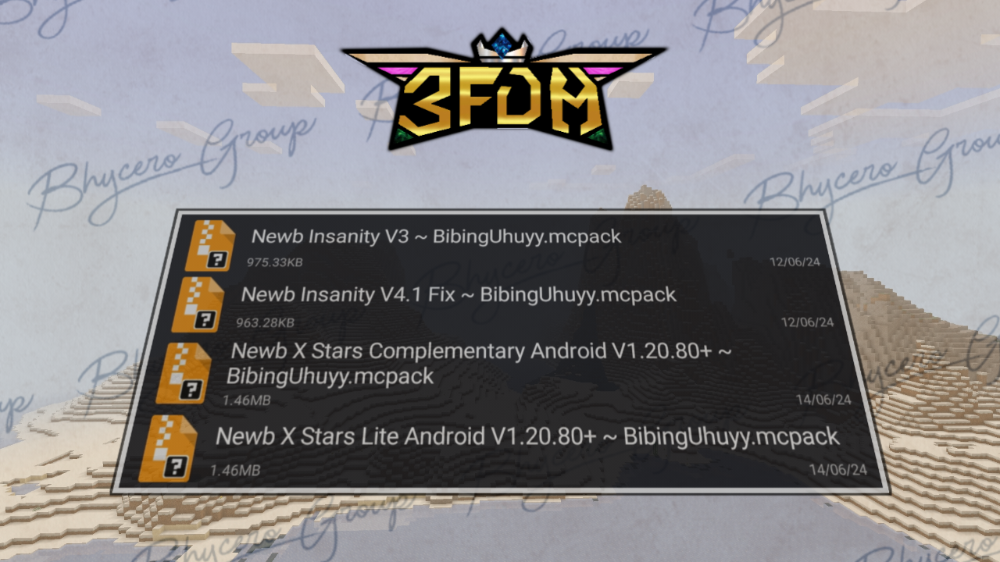

Inilah beberapa shader MCPE atau Bedrock yang bisa kamu coba!!!

<!-- truncate -->

## Rekomendasi Addon MCPE/Bedrock Untuk Survival
Kontributor
- Rivat
- AhZanMC
- Breeze

---
### NEWB SHADER
Newb Shader adalah Shader MCPE/Bedrock ringan dengan style vanilla yang meningkatkan estetika default. Newb X Legacy adalah versi porting untuk RenderDragon. Support untuk di Windows (MCWin10) dan Android (MCPE) versi 1.20.

#### Fitur :
* Pencahayaan : Menampilkan pencahayaan lembut alami yang dapat disesuaikan dengan banyak detail halus.
* Awan : Awannya lembut dan beradaptasi dengan hujan.
* Langit : Langit cerah dan tampak alami yang memberikan nuansa estetis pada shader.
* Air : Air yang tenang dan menenangkan yang benar-benar ringan namun terlihat indah.
* Underwater : Pemandangan berkabut kebiruan dengan kaustik lembut.
* Foliage wave : Animasi gelombang alami halus yang diterapkan pada rumput, dedaunan, tanaman merambat, dan tanaman.
* Lentern Wave : Mungkin sesuatu yang tidak Anda temukan di sebagian besar shader MCPE, lentera berayun.
* Kabut/Fog : Lapisan berkabut halus yang menyatu melintasi cakrawala, dengan tambahan lapisan berkabut yang memberikan kedalaman lebih pada dunia Anda.
* Cuaca hujan : Sesuatu yang disukai banyak pengguna tentang shader ini adalah cuaca hujan.
* Entity : Entity memiliki suasana lembut di sekelilingnya.
* Color correction : Menggunakan metode pemetaan nada yang sangat umum, namun tetap memberikan nada warna yang berbeda pada Newb Shader.
* Sun/Moon : Bulan vanila yang tampak 3D, dengan semua fase bulan. Matahari sangat lembut, namun tetap mempertahankan getaran vanilla.
* Glowy Ore : ore bersinar dalam kegelapan, membuatnya lebih mudah dikenali.
* Aurora : Langit malam dipercantik dengan lampu aurora yang berubah seiring waktu.

#### Screenshots in-game

#### Downloads
1. [Link Download 1 : MCPEDL](https://mcpedl.com/newb-shader/)
2. [Link Download 2 : Github](https://github.com/devendrn/newb-shader-mcbe)
3. [Link Download 3 : Mediafire (5+ File)](https://www.mediafire.com/file/i5k9u6fud3vuhtq/Newb_X_Shader__%257E_BibingUhuyy.zip/file)
4. [Link Download 4 : Mediafire (2+ FIle)](https://www.mediafire.com/file/4tce1v1lx4539la/2%252B_Newb_Shader_%257E_BibingUhuyy.zip/file)

---
### HyzeSh
Hyze Shader buat MCPE, shader ini adalah next generation dari Hyra Shader dan Zero Shader

1. [Link Download 1 : Modbay](https://mcpedl.com/newb-shader/)
2. [Link Download 2 : HyzeSh V1.0 (Low)](https://www.mediafire.com/file/ls5sc8xjxm4er39/HyzeSh_v1.0_RD_Android_Windows_1.20.80_up_%2528Simfile.co%2529_%257E_BibingUhuyy.zip/file)