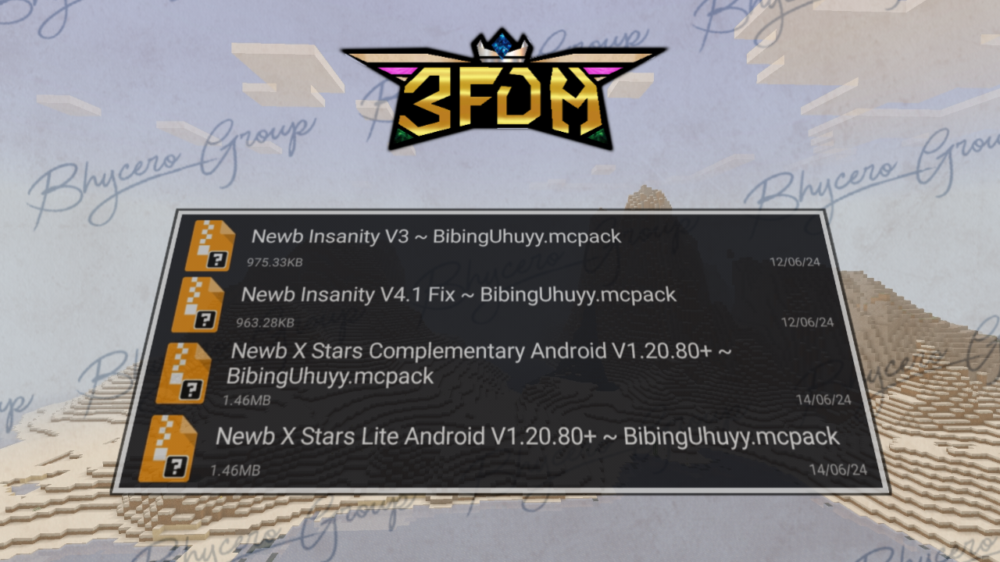
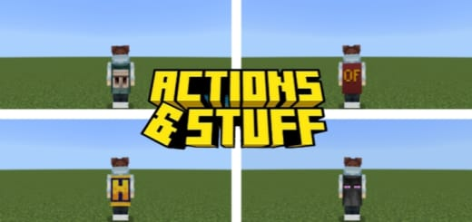
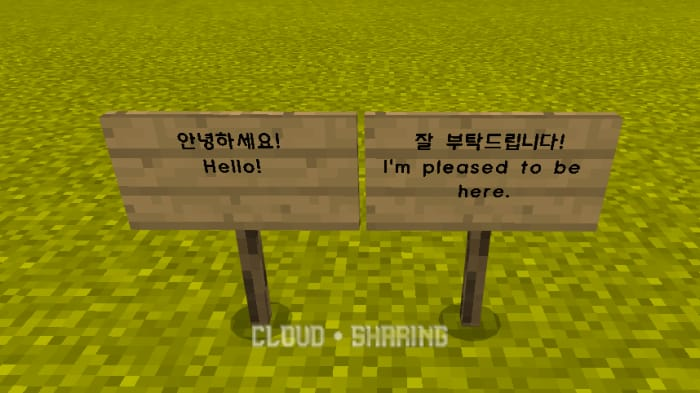

Inilah beberapa shader MCPE atau Bedrock yang bisa kamu coba!!!

<!-- truncate -->

Kontributor
- Oddo
- AhZanMC
- Breeze

---
### NEWB SHADER
Newb Shader adalah Shader MCPE/Bedrock ringan dengan style vanilla yang meningkatkan estetika default. Newb X Legacy adalah versi porting untuk RenderDragon. Support untuk di Windows (MCWin10) dan Android (MCPE) versi 1.20.

#### Fitur :
* Pencahayaan : Menampilkan pencahayaan lembut alami yang dapat disesuaikan dengan banyak detail halus.
* Awan : Awannya lembut dan beradaptasi dengan hujan.
* Langit : Langit cerah dan tampak alami yang memberikan nuansa estetis pada shader.
* Air : Air yang tenang dan menenangkan yang benar-benar ringan namun terlihat indah.
* Underwater : Pemandangan berkabut kebiruan dengan kaustik lembut.
* Foliage wave : Animasi gelombang alami halus yang diterapkan pada rumput, dedaunan, tanaman merambat, dan tanaman.
* Lentern Wave : Mungkin sesuatu yang tidak Anda temukan di sebagian besar shader MCPE, lentera berayun.
* Kabut/Fog : Lapisan berkabut halus yang menyatu melintasi cakrawala, dengan tambahan lapisan berkabut yang memberikan kedalaman lebih pada dunia Anda.
* Cuaca hujan : Sesuatu yang disukai banyak pengguna tentang shader ini adalah cuaca hujan.
* Entity : Entity memiliki suasana lembut di sekelilingnya.
* Color correction : Menggunakan metode pemetaan nada yang sangat umum, namun tetap memberikan nada warna yang berbeda pada Newb Shader.
* Sun/Moon : Bulan vanila yang tampak 3D, dengan semua fase bulan. Matahari sangat lembut, namun tetap mempertahankan getaran vanilla.
* Glowy Ore : ore bersinar dalam kegelapan, membuatnya lebih mudah dikenali.
* Aurora : Langit malam dipercantik dengan lampu aurora yang berubah seiring waktu.

#### Screenshots in-game

#### Downloads
1. [Link Download 1 : MCPEDL](https://mcpedl.com/newb-shader/)
2. [Link Download 2 : Github](https://github.com/devendrn/newb-shader-mcbe)
3. [Link Download 3 : Mediafire (5+ File)](https://www.mediafire.com/file/i5k9u6fud3vuhtq/Newb_X_Shader__%257E_BibingUhuyy.zip/file)
4. [Link Download 4 : Mediafire (2+ FIle)](https://www.mediafire.com/file/4tce1v1lx4539la/2%252B_Newb_Shader_%257E_BibingUhuyy.zip/file)

---
### HyzeSh
Hyze Shader buat MCPE, shader ini adalah next generation dari Hyra Shader dan Zero Shader

1. [Link Download 1 : Modbay](https://mcpedl.com/newb-shader/)
2. [Link Download 2 : HyzeSh V1.0 (Low)](https://www.mediafire.com/file/ls5sc8xjxm4er39/HyzeSh_v1.0_RD_Android_Windows_1.20.80_up_%2528Simfile.co%2529_%257E_BibingUhuyy.zip/file)

---
### Glow Ore Mcpe 1.21.20

Click here >> [Download](https://www.mediafire.com/file/to0q4wdunp4h4du/%255B1.21.20%255D_Glow_Ore_Mcpe.mcpack/file)

:::tip[NOTE]
Gunakan mcpe patch agar work
:::

---
### X-Ray Pro Texture Pack for Minecraft PE

> Download Link : https://www.mediafire.com/file/pi36z844z4t9oae/X-Ray_Pro_%257E_BibingUhuyy.mcpack/file

TYPE : **TEXTURE**

VERSI SUPPORT : **1.19.0 - 1.21.22**

AUTHOR : **Brandon Taylor**

Operating System : **Android**

SUMBER : https://whatsapp.com/channel/0029ValF5goIiRorpxIyWo2z

SHARE : **BibingUhuyy**

---
### Night Vision x RD [AhZanMC]

Texture Night Vision x RD [AhZanMC] adalah Texture Night Vision yang bisa work di resource pack.

Texture pack ini mendukung engine renderdragon,setelah texture pack diaktifkan, Anda akan bisa melihat lingkungan di sekitar Anda dengan lebih jelas di malam hari. Anda juga bisa melihat monster dan mob lain dengan lebih mudah.

**Fitur :**

* Bisa melihat di malam hari
* Bisa melihat di dalam cave yang gelap
* Bisa melihat di dalam ruangan yang gelap
* Support Renderdragon

**V1 (Support MC Bedrock : 1.20+)**

MCPE : [Download Here](https://www.mediafire.com/file/dxwpwfg96x05yeo/Night_Vision_x_RD_%255BAhZanMC%255D.mcpack/file)

**V2 (Support MC Bedrock : 1.20.40/41+)**

MCPE : [Download Here](https://www.mediafire.com/file/uh1w94pg79l5i1l/Night_Vision_x_RD_%255BAhZanMC%255D_MCPE_V2.mcpack/file)

MCWin10 : [Download Here](https://www.mediafire.com/file/te0oms4rmzli4qc/Night_Vision_x_RD_%255BAhZanMC%255D_MCWin10_V2.mcpack/file)

**V3 (Support MC Bedrock : 1.20.50/51+)**

MCPE : [Download Here](https://www.mediafire.com/file/qq2jz5vmulx4qvh/Night_Vision_x_RD_AhZanMC_V3_%2528MCPE%2529.mcpack/file)

MCWin10 : [Download Here](https://www.mediafire.com/file/m6hds08i1qfx13j/Night_Vision_x_RD_AhZanMC_V3_%2528MCWin10%2529.mcpack/file)

**V3.5 Tanpa Material Bin (Support MC Bedrock : Semua Versi)**

Download : [Download Here](https://www.mediafire.com/file/129qpjyvn9hxqt3/Night_Vision_x_RD_%255BAhZanMC%255D_V3.5_%2528Not_Using_Material_Bin%2529.mcpack/file)

**V4 (Support MC Bedrock : 1.21)**

MCPE : [Download Here](https://www.mediafire.com/file/is0i64cbvvnm7y2/Night_Vision_x_RD_%255BAhZanMC%255D_V4_For_MCPE_Only.mcpack/file)

:::warning[Catatan]
Untuk Night Vision x RD [AhZanMC] V1-4 yang menggunakan Material bin, harap gunakan MCPE Patch yang mendukung
:::

---
### X-RAY NEW VERSION

> Link :
https://www.mediafire.com/file/10vkdkyduxxi9wt/X-RayByd6b.mcpack/file

> Fitur :
- Support Server

> Credit : Bhycero Group
> Share : Tim Bhycero Group

---
### Colorfull Banner Pattern

📍Link Download
> https://www.mediafire.com/file/7dd4o0x5e2y7bx1/Colourfull_banner_pattern.Mcpack/file

Tipe : Texture🌏
Credit : PandaCraft
Posting : The Breeze 💨

---
### [ Texture ] ActionsStuff Capes

https://www.mediafire.com/file/djmsd01f9mjdg3a/ᴋɪᴍᴏɴᴏᴋɪ+ActionsStuff+Capes.zip/file

Bonus Actions & Stuff 🎉
https://www.mediafire.com/file/ut52abxetd9g169/ᴋɪᴍᴏɴᴏᴋɪ+Actions+&+Stuff+MinecraftPE+TXT.zip/file

> 『🎁』────────────────────『 ❏ 』

> 🍁 Download Search : Modbay

> 🌲 © Post : ᴋɪᴍᴏɴᴏᴋɪ ᴅᴏᴡɴʟᴏᴀᴅ

> 📥 Size : 2.18MB

> ☘️ Type : zip

> 『🎁』────────────────────『 ❏ 』

---
### PvP Fps Boost
- Puma 32x : https://www.mediafire.com/file/9d0u982txlir43g/Puma_32x.mcpack/file 

- Black White : https://www.mediafire.com/file/z3zlvmge8t5qs9a/Black_White_by_Menop.mcpack/file

- Absolute : https://www.mediafire.com/file/l30od5zyy6mbp7i/Absolute_32x.mcpack/file

- Versi : 1.20-1.21+

- Search : YouTube

- Minecraft Original & Patch

---
### Korean Font

[ Download ]

https://www.mediafire.com/file/xvr3y0etebkq4pd/Korean_Smooth_Font_v1.1.2.mcpack/file

[ Deskripsi ]

texture ini merubah font di minecraft menjadi lebih halus dan keren 

> Credit : Cloud

---
###

---
###

---
###

---
###

---
###

---
###

---
###

---
###

---
###

---
###

---
###

---
###

---
###

---
###

---
###

---
###

---
###

---
###

---
###

---
###

---
###

---
###

---
###

---
###

---
###

---
###

---
###

---
###
