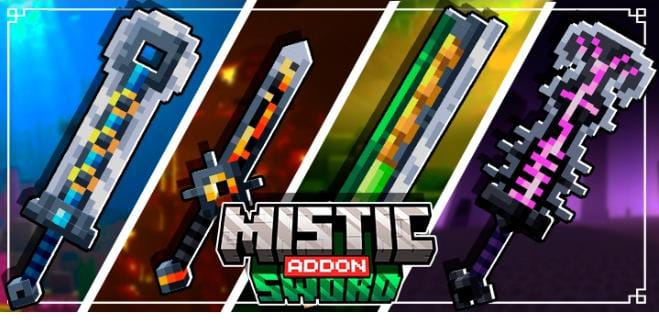
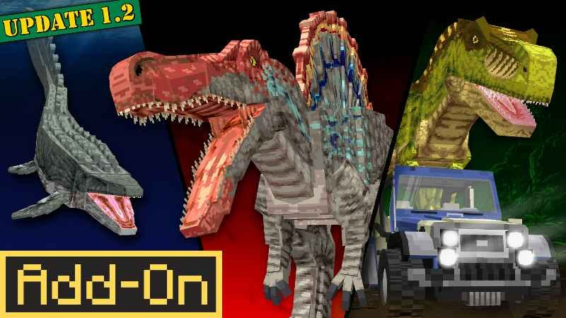
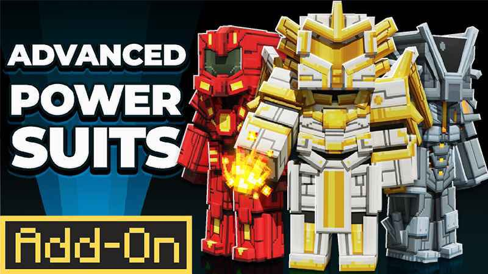

Rekomendasi Addon MCPE/Bedrock Keren
<!-- truncate -->

## Rekomendasi Addon MCPE/Bedrock Keren
Kontributor
- Rivat
- AhZanMC
- Breeze

---
### Custom 3d totem
[Download](https://www.mediafire.com/file/0j47r879wha0946/CUSTOM_3D_TOTEM_%2528Player_Skin_Model%2529.zip/file)

---
### Decocraft
[Download](https://www.mediafire.com/file/zg6y2xg1lcg8brb/Decocraft_Base_By_Void.mcaddon/file)

---
### Dragon Fire
[Download](https://www.mediafire.com/file/jfigpuh3l1lk2ye/DragonFire_Add-on_By_Void.mcaddon/file)

---
### Health Bars:
[Download](https://www.mediafire.com/file/vcj15j3mi0nurnl/Health_Bars.mcaddon/file)

---
### ADDON ZOMBIE APOCALIPS

📦 `PROJECT WALKER:`

*LINK*: https://modbay.org/mods/718-project-walker.html

📦 `VOODO ZOMBIE:`

*LINK*: https://mcpedl.com/voodoo/

📦 `FELLFANG: GLUTTONY:`

*LINK*: https://mcpedl.com/fellfang-gluttony-beta-v0-6/

📦 `MUTATED ZOMBIE:`

*LINK*: https://mcpedl.com/mutated-zombies/

📦 `TISSOU'S ZOMBIE:`

*ZOMBIE*: https://mcpedl.com/better-zombie-pack/

*VILLAGER*: https://mcpedl.com/zombie-villager-varients-pack/

📦 `APLOK GUNS:`

*LINK*: https://modbay.org/mods/586-aplok-guns.html

📦 `KOTA ZOMBIE:`

https://www.planetminecraft.com/project/mosslorn-1000x1000-abandoned-city-map-bedrock-port-by-den-worlds-studios/

> CREDIT: LEXAAAMC

> SUMBER: LEXAAAMC

> JANGAN HAPUS CREDIT

© JAYAKIMOCHI
https://whatsapp.com/channel/0029Vag54f7DTkK7ouZkS214

---
### Custom 3d totem

[Click to Download](https://www.mediafire.com/file/0j47r879wha0946/CUSTOM_3D_TOTEM_%2528Player_Skin_Model%2529.zip/file)

---
### Decocraft

[Click to Download](https://www.mediafire.com/file/zg6y2xg1lcg8brb/Decocraft_Base_By_Void.mcaddon/file)

---
### Dragon Fire

[Click to Download](https://www.mediafire.com/file/jfigpuh3l1lk2ye/DragonFire_Add-on_By_Void.mcaddon/file)

---
### Health Bars:

[Click to Download](https://www.mediafire.com/file/vcj15j3mi0nurnl/Health_Bars.mcaddon/file)

---
### MISTIC ADDON SWORD

**LINK DOWNLOAD :** [Click to Download](https://www.mediafire.com/file/0qljv3uk11bdfta/sword_BE.mcaddon.zip/file)

---
### PALEOCRAFT DINOSAUR BREAKOUT

[Click to Download](https://www.mediafire.com/file/23cen182lbxxcrg/Paleocraft_Dinosaur_Breakout_By_Void.mcaddon/file)

---
### RAINBOW WEAPONS

[Click Here to Download](https://www.mediafire.com/file/jyccveos3ciuwtl/RAINBOW_WEAPONS_By_robyDoow_%28world_template%29.mctemplate.zip/file)

.jpg)

---
### Advance Power Suits

[Click Here](https://www.mediafire.com/file/bsp32ysv1rl8kyy/Advanced_Power_Suits_%2528Add-On%2529.mcaddon/file)

---
### Addon WorldEdit: Bedrock Edition

Ini adalah addon Minecraft Bedrock atau MCPE yang di porting dari mod WorldEdit yang terkenal untuk Minecraft Java Edition. Addon ini dilengkapi dengan command khusus untuk membuat proses build/membangun menjadi lebih mudah dan lebih menyenangkan!. Gak cuma itu, ada juga item khusus untuk memudahkan siapa pun di perangkat apa pun untuk menggunakannya. Dan buat para builder wajib tau addon ini

**Fitur**

WorldEdit: Bedrock Edition memiliki banyak fitur penting yang dimiliki mod asli. Ini termasuk, tetapi tidak terbatas pada:

* Clipboard (Cut, Copy, Paste)
* Kit WorldEdit yang nyaman untuk mengakses fitur-fitur umum
* Rotate dan flip
* Perintah navigasi
* Brush
* Undo dan Redo
* Fill dan replace block

**Catatan: Addon ini bergantung pada fitur eksperimental**

Download Disini : [Click Here](https://mcpedl.com/worldedit-be-addon/)

Dokumentasi atau panduan cara pakai addon : [Click Here](https://worldedit-be-docs.readthedocs.io/en/stable/)
---