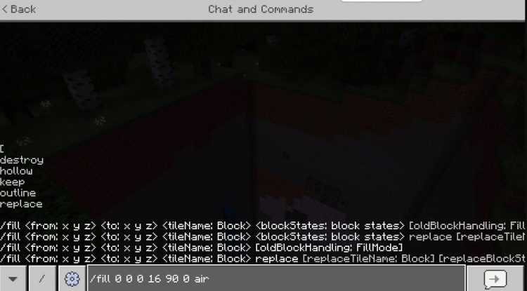

## Cara menggunakan Command fill



Penjelasan:

Berikut adalah langkah-langkah menggunakan Command fill:

1. Tentukan Koordinat: Tentukan dua koordinat yang ingin Anda isi atau ubah. Misalnya, sudut pertama berada di (35, 67, 1293) dan sudut kedua di (51, 67, 1241).
2. Masukkan Command: Ketik Command “/fill” diikuti oleh koordinat yang telah Anda tentukan. sebagai contoh, “/fill 35 70 1293 55 62 1241”.
Pilih Blok yang Akan Digunakan: Setelah memasukkan koordinat, tambahkan nama blok yang ingin Anda gunakan. Misalnya, “minecraft: Stone” atau “minecraft: Wood”

Contoh command

```
# pakai id
/fill 35 70 1293 55 62 1241 minecraft: Stone

# pakai nama
/fill 35 70 1293 55 62 1241 stone
```

3. Tambahkan Variasi Blok (Opsional): Anda juga bisa menambahkan nomor variasi blok, terutama untuk jenis blok seperti kayu yang memiliki beberapa varian.

```
Eksekusi Command: Kirimkan Command tersebut di chat, dan area yang Anda tentukan akan terisi dengan blok yang Anda pilih.
```
